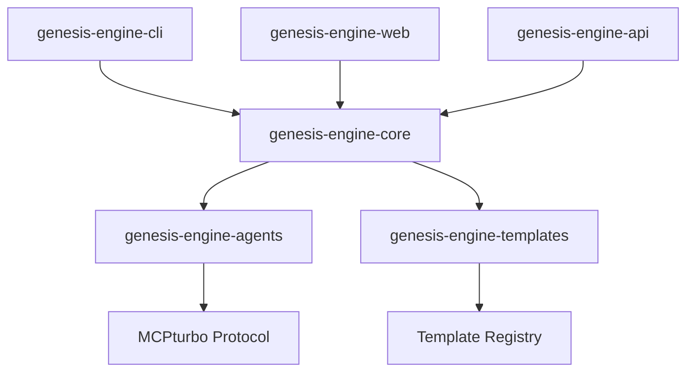

# 🚀 Genesis Engine

> AI-powered code generation platform that creates complete applications

## 🏗️ Architecture Overview

Genesis Engine is built as a distributed system with multiple specialized repositories:

### 📦 Core Repositories

| Repository | Description | Status | Version |
|------------|-------------|---------|---------|
| [genesis-engine-core](https://github.com/your-org/genesis-engine-core) | Main orchestration engine | ✅ Active | v2.1.0 |
| [genesis-engine-cli](https://github.com/your-org/genesis-engine-cli) | Command line interface | ✅ Active | v1.8.0 |
| [genesis-engine-agents](https://github.com/your-org/genesis-engine-agents) | AI agents collection | ✅ Active | v1.5.0 |
| [genesis-engine-templates](https://github.com/your-org/genesis-engine-templates) | Code templates library | ✅ Active | v1.3.0 |

### 🌐 Platform Repositories

| Repository | Description | Status | Version |
|------------|-------------|---------|---------|
| [genesis-engine-web](https://github.com/your-org/genesis-engine-web) | Web dashboard & editor | 🚧 Beta | v0.9.0 |
| [genesis-engine-api](https://github.com/your-org/genesis-engine-api) | REST/GraphQL APIs | ✅ Active | v1.2.0 |
| [genesis-engine-studio](https://github.com/your-org/genesis-engine-studio) | Visual workflow editor | 🚧 Alpha | v0.5.0 |

### 📚 Documentation & Examples

| Repository | Description | Status |
|------------|-------------|---------|
| [genesis-engine-docs](https://github.com/your-org/genesis-engine-docs) | Documentation site | ✅ Active |
| [genesis-engine-examples](https://github.com/your-org/genesis-engine-examples) | Example projects | ✅ Active |

## 🚀 Quick Start

### Option 1: CLI Installation
```bash
npm install -g @genesis-engine/cli
genesis init my-app
```

### Option 2: Web Dashboard
Visit [Genesis Studio](https://studio.genesisengine.dev) for visual project creation.

### Option 3: API Integration
```bash
curl -X POST https://api.genesisengine.dev/generate \
  -H "Content-Type: application/json" \
  -d '{"type": "web-app", "requirements": "E-commerce with auth"}'
```

## 🏗️ System Architecture



## 📖 Documentation

- **[Architecture Guide](./docs/ARCHITECTURE.md)** - System design and components
- **[Development Guide](./docs/DEVELOPMENT.md)** - Contributing and development setup
- **[API Reference](https://docs.genesisengine.dev)** - Complete API documentation
- **[Examples](https://github.com/your-org/genesis-engine-examples)** - Real-world examples

## 🤝 Contributing

Each repository has its own contribution guidelines, but here's the general process:

1. **Fork** the specific repository you want to contribute to
2. **Create** a feature branch (`git checkout -b feature/amazing-feature`)
3. **Commit** your changes (`git commit -m 'Add amazing feature'`)
4. **Push** to the branch (`git push origin feature/amazing-feature`)
5. **Open** a Pull Request

See [CONTRIBUTING.md](./CONTRIBUTING.md) for detailed guidelines.

## 📄 License

Genesis Engine is licensed under the MIT License. See [LICENSE](./LICENSE) for details.

---

<div align="center">
  <strong>🌟 Star us on GitHub if Genesis Engine helps you build amazing things!</strong>
</div>
